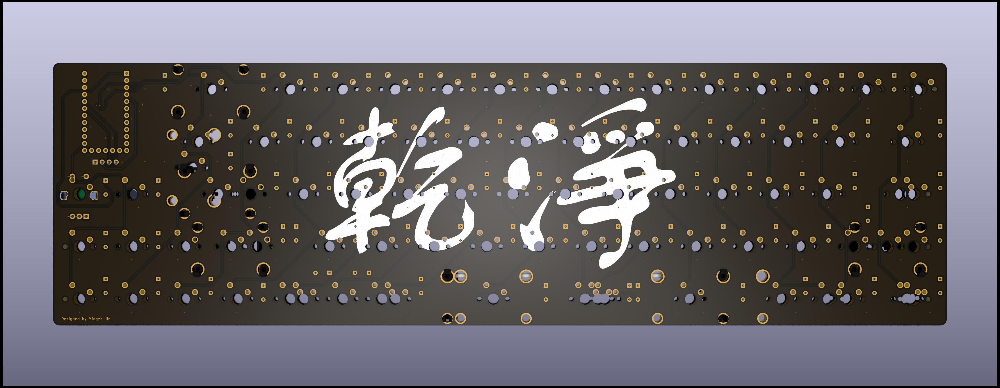
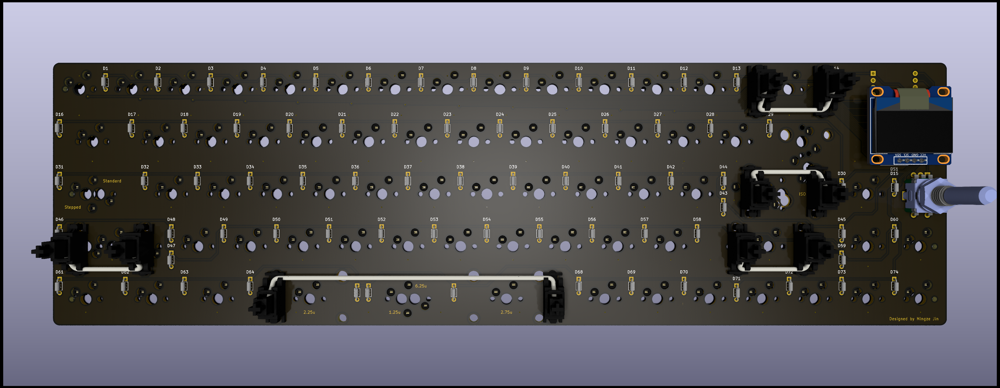

# GanJing 65 rev 2.0
**A 65% keyboard with a rotary encoder, OLED screen and USB-c. Made using the Elite-c and through-hole components for easy soldering.**

[Bill of materials](https://octopart.com/bom-tool/jvwkTsDN)

## Layout options
The GanJing 65 supports ISO layouts, stepped caps lock, and split spacebar options. There is also a hotswap PCB available but it has reduced layout options

### Solder

### Hotswap

## Schematic

### Solder

### Hotswap

## Solder PCB layout
### Front

### Back

## Hotswap PCB layout
### Front

### Back
