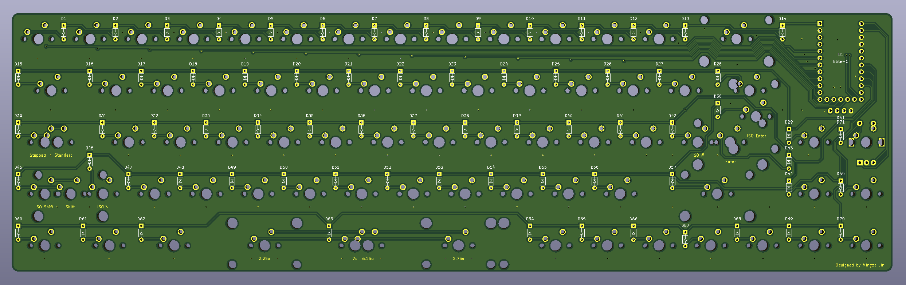

# GanJing 65 rev 2.0
**A 65% keyboard with a rotary encoder, OLED screen and USB-c. Made using the Elite-c and through-hole components for easy soldering.**

[Bill of materials](https://octopart.com/bom-tool/HPiXAxIx)

## Layout options
The GanJing 65 supports ISO layouts, stepped caps lock, and split spacebar options.

## Schematic

## PCB layout
### Front

### Back

